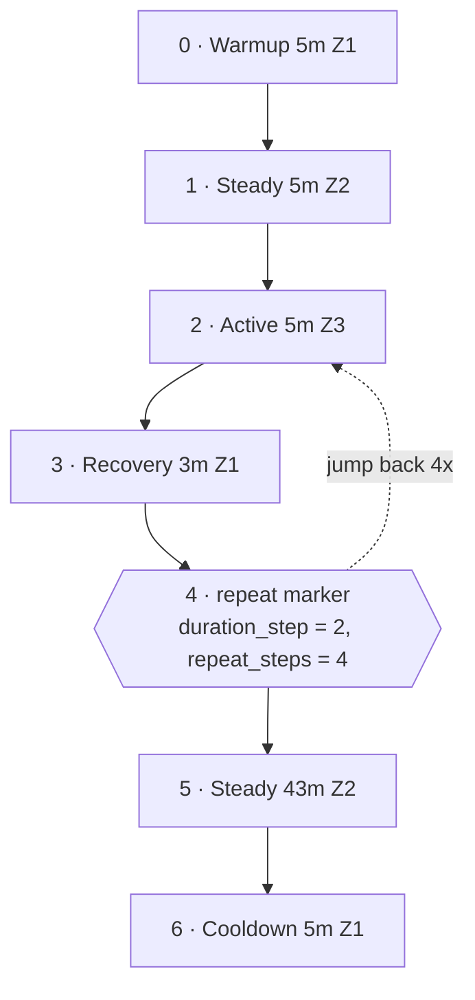

In July 2024 I lined up in Lake Placid for my first Ironman. For the sixteen months before that, I trained with [80/20 Endurance](https://www.8020endurance.com/) plans and tracked everything on [intervals.icu](https://intervals.icu/).

The 80/20 method comes from [*80/20 Triathlon*](https://www.8020books.com) by Matt Fitzgerald and David Warden. The premise, built on Stephen Seiler's research into how elite endurance athletes distribute their training, is that about 80 percent of your time should be spent at low intensity and only 20 percent at moderate or high intensity. Most self-coached athletes drift toward the middle, where every session is somewhat hard and none are truly easy. The book's fix is discipline about easy days, enforced by structured workouts with strict intensity targets. I had the paperback on my shelf for the whole training block, and the workout library 80/20 publishes online, 621 structured workouts as Garmin `.FIT` files, is that book's catalog in digital form.

Both platforms are good at what they do. They just don't talk to each other. Intervals.icu has a workout builder that accepts a text-based DSL: markdown-ish lines like `- 5m 91-100%` with section headers like `Warmup` and `Main Set 1 4x`. If you train with 80/20 plans and want your workouts loaded into intervals.icu as editable builder text, you're transcribing them by hand or relying on FIT import, which gives you a binary blob you can't edit.

So I wrote a CLI. It scrapes the 80/20 library, converts each FIT workout to intervals.icu DSL, and uploads it. The repo is [pperanich/8020](https://github.com/pperanich/8020).

## The pipeline

`scrape` fetches the 80/20 library page, regex-extracts every `.FIT` href, and downloads all 621 concurrently. It skips files already on disk, so interrupting and re-running picks up where you left off.

`convert` parses each FIT file, builds a `Workout` tree, and renders intervals.icu DSL text beside the original. Here's `CCI20`, a bike interval workout:

```
# CCI20

Warmup
- 5m 50-70%

Steady
- 5m 70-83%

Main Set 1 4x
- 5m 91-100%
- Recovery 3m 50-70%

Steady
- 43m 70-83%

Cooldown
- 5m 50-70%
```

`upload` converts and POSTs each workout to the intervals.icu REST API with HTTP Basic auth, per their convention (username `API_KEY`, API key as password).

## The FIT repeat problem

FIT files don't store workouts as a tree. They store a flat list of steps, and repeat blocks are encoded as a trailing special step with `duration_type = "repeat_until_steps_cmplt"`, a `duration_step` field pointing back to the first body step, and a `repeat_steps` count. The file says "repeat from step 2, four times" (steps are zero-indexed, so that's the first interval) and leaves you to figure out the structure.

Here's what CCI20 actually looks like on disk:



Steps 2 and 3 are the repeat body, but nothing in those steps says so. Only the marker at step 4 knows, and it points backward.

The `nest()` function in [`src/fit.rs`](https://github.com/pperanich/8020/blob/main/src/fit.rs) reconstructs the tree. When it hits a repeat marker, it locates the jump target, counts how many steps belong to the body, and wraps them into a `Step::Repeat { count, body }`. This is the trickiest logic in the codebase and the part I was most careful to test, because a wrong offset silently produces a workout that looks right but trains you wrong.

## Zone tables

80/20 defines five zones per sport with specific percentage ranges. These are hardcoded in `lib.rs`:

| Zone | Run (HR)    | Bike (%FTP) | Swim (Pace) |
|------|-------------|-------------|-------------|
| 1    | 72-81%      | 50-70%      | 75-84%      |
| 2    | 81-90%      | 70-83%      | 84-91%      |
| 3    | 95-100%     | 91-100%     | 96-100%     |
| 4    | 102-105%    | 102-110%    | 102-106%    |
| 5    | 105-111%    | 110-125%    | 106-120%    |

The gaps between zones 2-3 and 3-4 aren't typos. 80/20's method defines Zone X and Zone Y as gray zones the workouts deliberately avoid, so no step ever targets, say, 87% FTP on the bike.

The renderer picks the right suffix per sport: `% HR` for run, bare `%` for bike (power %FTP is the default in intervals.icu), `% Pace` for swim. A bike zone 3 step renders as `91-100%`; the same zone for a run renders as `95-100% HR`.

## Swim pool length from the filename

This one surprised me. FIT files always store distance in meters, even when the author specified yards. A 250-yard swim becomes 228.6 m in the file. 80/20 encodes the pool length in the workout filename instead: `SAe1 25y` is a 25-yard pool, `SAe1 25m` is 25 meters.

The converter parses the trailing token from the filename, adds a `*Pool: 25y*` indicator line to the DSL, and converts distances back to yards for yard-pool workouts. Without this, every yard-pool workout would show distances about 9% too short and in the wrong unit.

## Section grouping for the DSL parser

Intervals.icu's parser needs section headers (`Warmup`, `Steady`, `Cooldown`) to terminate repeat blocks. A blank line alone doesn't do it. The `group_steps` function in `dsl.rs` groups contiguous single steps by intensity, so a run of warmup steps gets one `Warmup` header, a run of steady work gets `Steady`, and each repeat block gets its own `Main Set N {count}x` header. Getting this wrong means the parser merges blocks that should be separate.

## Validating 621 workouts offline

I didn't want to find out the DSL was malformed by uploading to a live account. The repo includes a Node script (`scripts/validate.mjs`) that runs every generated `.txt` through [intervals-icu-workout-parser](https://github.com/marvinnazari/intervals-icu-workout-parser), a third-party TypeScript AST parser for the intervals.icu DSL. It checks that each file parses, produces at least one step, and every step has a duration.

```sh
node scripts/validate.mjs workouts/
# 621/621 workouts parsed cleanly
```

A Rust CLI that shells out to a Node validator is a little inelegant. But the intervals.icu DSL parser already existed, it's the same AST the platform uses, and rewriting it in Rust would have been a week of work for no marginal benefit. I took the pragmatic route.

## Build story

The project started as a Python notebook. I rewrote it in Rust when the FIT parsing and concurrent scraping outgrew a notebook's ergonomics, and added a Nix flake for reproducible builds. The flake gives you `nix develop` for the toolchain, `nix build` for the binary, and `nix run` to execute it directly.

The whole thing is about 900 lines of Rust and 80 lines of JavaScript. Focused, single-purpose, and it solved a real problem I had for a year and a half of training.

## Honest limitations

The `upload` subcommand is based on documented API convention but hasn't been end-to-end tested against a live intervals.icu account. I built the scrape and convert pipeline first, used it to generate all 621 DSL files, validated them offline, and uploaded manually through the intervals.icu web UI. Automating the upload is the last mile, and it's the part I'm least certain about. Open-duration swim steps (rest at touch-turn) render as `lap`, which isn't in the official syntax guide; the offline parser accepts it but the live UI may not.

If you train with 80/20 and track on intervals.icu, [give it a try](https://github.com/pperanich/8020). The scrape and convert pipeline is solid. Upload at your own risk.
