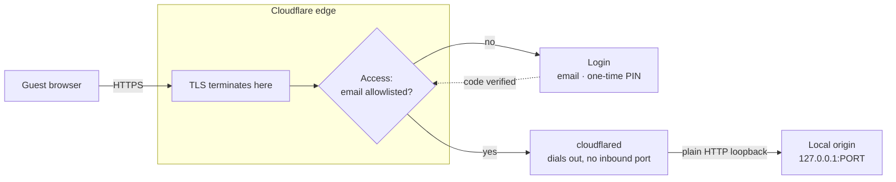
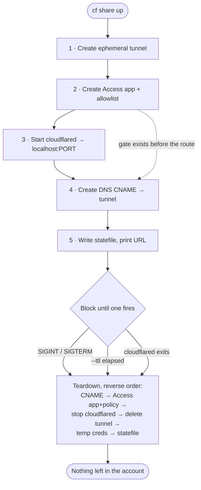

In [Part 5](/posts/dotfiles-part-5-tooling-edges) I described the `cf` CLI (`pkgs/cf/`) as a tunnel state machine: a Go tool that provisions a persistent Cloudflare Tunnel, reconciles DNS, and reasons carefully about the three places a tunnel's state can live. That tool has since grown two capabilities that sit at opposite ends of the same spectrum. One creates infrastructure that exists for a few hours and then vanishes. The other keeps permanent infrastructure pinned to a declaration in the repo. Both are built on the same reconcile-diff-apply core, and both exist to solve the same underlying problem: how do you let a specific person reach a specific self-hosted service, without opening a port, buying a static IP, or making anything public?

## The security model, briefly

A Cloudflare Tunnel is an outbound-only connection. `cloudflared` dials the edge; nothing dials in. There is no inbound port to forward, no WAN listener, and it works unchanged behind NAT or CGNAT because the origin never has to be addressable. TLS terminates at the Cloudflare edge, so the last hop from `cloudflared` to the local service is plain loopback HTTP. On its own, that just makes a service reachable. The gate is Cloudflare Access: a self-hosted Access application sits in front of the hostname and bounces every unauthenticated request to a login before a single byte reaches the origin. Pair an email allowlist with the One-time PIN identity provider and a guest proves they own an allowlisted address by receiving a code. No account, no shared password.



The whole design only works if the gate is never missing while the route is live. That constraint shows up in both features below, in different forms.

## `cf share`: infrastructure with a lifetime

The everyday problem: someone wants to look at a service running on my laptop or a homelab box. A collaborator reviewing a work-in-progress, a friend I want to hand a running app to for an afternoon. I do not want a permanent public hostname for that, and I definitely do not want to leave one lying around after.

`cf share up` treats the entire exposure as ephemeral, including the tunnel itself:

```sh
cf share up --host demo --port 8080 --email guest@example.com --ttl 4h
```

On `up`, in order, it:

1. Creates a throwaway tunnel (a random 32-byte secret, credentials held in memory, never written to sops).
2. Creates a self-hosted Access application for `demo.<zone>` with an allowlist policy for the given email(s). The gate goes up *before* the route.
3. Starts `cloudflared` as a child process pointed at `http://localhost:8080`.
4. Creates the DNS `CNAME` to `<tunnel-id>.cfargotunnel.com`.
5. Writes a small statefile, prints the live URL, and blocks.

Then it waits on three things at once: a `SIGINT`/`SIGTERM`, the optional `--ttl` timer, or `cloudflared` exiting on its own. Whichever fires, teardown runs and reverses everything: delete the CNAME, delete the Access app and policy, stop `cloudflared` with a `SIGTERM` so it drains its edge connections cleanly, delete the tunnel, remove the temp credentials and the statefile. Nothing is left in the account.



The interesting parts are not the create calls. They are the failure modes.

The create order is deliberate. The gate goes up at step 2 and the DNS route at step 4, so if the process dies between them the route never exists without its gate: a half-finished share fails closed, not open.

Teardown has to survive a crash. The statefile in `$XDG_RUNTIME_DIR` records every resource ID, so a later `cf share down --host demo` can finish the cleanup even if the original process was killed. With no statefile, `down` reconstructs what it can from the API, finding the ephemeral tunnel by name and the Access app by domain.

Then there is the rule that took the most care to get right: never delete what you did not create. `share` reuses an existing Access app for a domain rather than creating a duplicate, but a reused app is one it did not make, so teardown must leave it alone. The state carries a `CreatedApp` flag, and the crash-recovery path only adopts an app whose name carries the `cf-share:` prefix. A share for a host that collides with a permanent gated service can never tear that service's gate down.

There is also a `--exec` flag that runs a command as the app for the tunnel's lifetime, so the process being shared and the tunnel share the same fate:

```sh
cf share up --host preview --port 5173 --email guest@example.com \
  --exec "npm run dev"
```

Ctrl-C stops the dev server and removes the tunnel, gate, and DNS in one motion.

### One tunnel, several subdomains, one login

A single `cf share` exposes one origin, but a real application is often several services: an SPA, its API, docs, a metrics dashboard. The pattern that handles this is to front all of them with a local reverse proxy on one port (a Caddy listening on `:8080` with a vhost per subdomain), share that single port, and then hang the sibling hostnames off the *same* ephemeral tunnel:

```sh
# primary origin: ephemeral tunnel + gate + CNAME, blocks
cf share up --host app --port 8080 --email guest@example.com --ttl 12h

# second shell: point the sibling subdomains at the same tunnel
TUNNEL_ID=$(cf tunnel list | awk '/cf-share-app/{print $1; exit}')
cf tunnel sync-dns --tunnel-id "$TUNNEL_ID" \
  --hostname landing.example.com \
  --hostname docs.example.com \
  --hostname metrics.example.com \
  --apply
```

One wildcard Access application (`example.com` and `*.example.com`) then gates every subdomain behind a single login, so a guest authenticates once and moves between the app, its docs, and its dashboards with no re-prompt. The one wrinkle worth knowing: an SPA whose API base is compiled in must be built to call a *same-origin* relative path, or the browser will make a cross-origin request that Access bounces to a login page mid-session. Terminating everything on one host through one proxy sidesteps that entirely.

## `cf access sync`: gates as a declaration

The other end of the spectrum is a service I want to expose permanently to a small, known set of people. A self-hosted Git server is the canonical case: it lives behind the tunnel forever, and exactly a handful of addresses should ever reach it.

Doing that by hand in the Cloudflare dashboard works once and then rots. The allowlist drifts from whatever I think it is, and there is no record in the repo of who has access. So `cf access sync` applies the same reconcile pattern the DNS and tunnel commands already use: read a desired-state JSON, list the actual Access applications, diff, and apply.

```
$ cf access sync --config apps.json --prune --apply
Syncing Access applications for <account>...
  OK      git.example.com                          (1 emails)

Summary: 0 create, 0 update, 1 unchanged, 0 delete
```

Managed apps are identified by a `cf-access:` name prefix rather than a Cloudflare tag. Tags looked like the obvious choice, but Access requires tags to be pre-created before they can be assigned, which a reconciler cannot assume. A name convention needs no setup and is just as reliable for telling "apps I manage" apart from "apps someone made by hand," which sync leaves untouched.

Two decisions make it safe to run unattended on a timer:

It fails loudly. If any create or update errors, the whole run exits non-zero instead of logging and moving on. A gate that silently fails to sync while its route stays live is precisely the fail-open case the design exists to prevent.

It also reconciles the policy in place. If an app already has a policy, sync updates its include-rules; if it has none, sync creates one and links it. The app's own configuration is never dropped and recreated, so a routine allowlist edit does not disrupt an in-flight session.

## Wiring it into Nix so a service cannot escape its gate

The reconciler is only half the story. The other half is making it impossible to declare a gated service and forget the gate. In the router's config, one list entry describes a gated service, and everything else is derived from it:

```nix
tunnelApps = [
  {
    sub = "git";
    backend = "localhost:${toString config.my.gitea.port}";
    port = 8225;
    emailsSecret = "gitea-allowlist";
    extraConfig = "header_up X-Forwarded-Proto {scheme}";
  }
];
```

From that single entry, the module generates the Caddy loopback listener, the tunnel ingress rule, the sops secret reference, and the Access allowlist. The listener, the route, and the gate are the same declaration. You cannot add the route without adding the gate, because they are the same list element.

The allowlist emails are the one thing that must not end up in the Nix store, which is world-readable. So they never appear in the module at all. Each entry names a sops secret holding a JSON array of addresses, and the module splices the sops *placeholder* into a rendered config template:

```nix
sops.templates."cf-access-apps.json".content =
  ''{"apps":[{"domain":"${mkSub app.sub}","name":"cf-access: ${app.sub}",''
  + ''"emails":${config.sops.placeholder.${app.emailsSecret}}}]}'';
```

At build time the store only ever sees the placeholder token. At activation, sops-nix renders the real file, and `systemd` hands it to the sync unit through `LoadCredential`, so a `DynamicUser` service can read it while the source stays root-only. Adding or removing a guest is a `sops` edit plus a timer tick, and their address never touches Git or the store.

The same gate-before-route ordering from `cf share` reappears here as a `systemd` dependency. The unit that publishes the tunnel's DNS is ordered after the unit that reconciles the gate:

```nix
systemd.services.cf-tunnel-dns-sync = lib.mkIf (managed != [ ]) {
  after = [ "cf-access-sync.service" ];
  wants = [ "cf-access-sync.service" ];
};
```

This is deliberately `wants` and not `requires`. A typo in one service's allowlist should not also block DNS for the unrelated services sharing that tunnel. The gate persists at Cloudflare once created, so the window where a route could exist without a gate is limited to a first-time deploy, and the fail-loud sync makes that window noisy rather than silent. Closing it completely would mean splitting the gated host's DNS out of the shared publish step, which is a trade I did not think this case was worth.

## What this opened up

Having both modes changes what "share this with someone" costs, and a few things that used to need standing infrastructure are now disposable:

- Handing a running local app to one reviewer for an afternoon, gated behind their email, gone by dinner, is a single command.
- A permanent internal service reachable by a named allowlist, with no VPN enrollment and no open ports, where the allowlist is a reviewed change in the repo rather than dashboard folklore.
- Onboarding one external contractor to exactly one internal application: an entry in a list and an email in a secret.

The create calls were the easy part. Most of the code in both features is teardown and drift handling: finishing cleanup after a crash, refusing to delete a resource the tool did not create, keeping a gate from going missing while its route is live. That is deliberate. An exposure you cannot reliably undo is worse than none, because it accumulates: orphaned tunnels, stale allowlists, gates nobody remembers opening.
