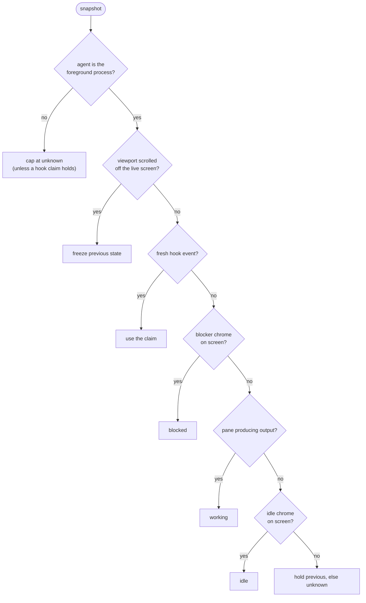

I run coding agents in tmux panes, usually three or four at a time, spread across windows for different repos. Each one is a long-lived interactive TUI process that alternates between doing work and stopping to ask me something.

The problem with that arrangement is that an agent which stops asking has no way to tell me. It hits a permission prompt in a window I'm not looking at, paints `❯ 1. Yes` on the screen, and waits. I find it twenty minutes later when I happen to switch windows. The state I needed was rendered to a pane nobody was watching, and nothing about tmux's default chrome distinguishes that window from one where an agent is happily churning.

So I wrote [`tma`](https://github.com/pperanich/tmux-agents), an agent state monitor for tmux. It identifies which panes contain agents, decides whether each one is working, blocked, or idle, and jumps you to whichever needs an answer. It's about 52k lines of Rust across seven crates, dual MIT/Apache licensed, and I made it public this week. Six agents ship with detection out of the box: Claude Code, Codex CLI, OpenCode, Gemini CLI, Cursor CLI, and pi.

## What the existing tools do

One approach is to make the monitor a terminal multiplexer with agent detection built in, which is what herdr does. It owns the PTYs, so it sees byte-level activity, the live screen, and process lifetime with no polling anywhere. That works. The cost is that it replaces tmux. If you have a sessionizer, worktrees as windows, custom bindings, and a tuned status line, adopting it means nesting one multiplexer inside another: two prefix keys, two detach models, and panes the outer tmux cannot see. The part worth keeping from that design isn't the multiplexer. It's the detection model underneath, which identifies the agent by process name and reads its state off the terminal screen through declarative per-agent rules. PTY ownership, session persistence, and pane management are things tmux already provides.

Two other projects kept tmux, and each demonstrated half of what I needed. `tmux-agent` (`ta`, by Trent Davies) is a one-shot stateless CLI with an embedded fuzzy picker, invoked from a keybinding. It shows that the layered evidence model works with no resident process at all: a hook-stamped tmux option beats a screen scrape, which beats a pane title. Its detection rules live in Rust source, so tuning one is a recompile.

`tmux-agent-sidebar` (by hiroppy) is a tmux plugin with a persistent sidebar. It demonstrates hook-driven ingress with pane options as the public bus, plus several patterns I adopted outright: a stable wrapper script the agent config points at, one tested resolver for state priority, and a guard against an agent's subagents clobbering the parent's row. Its limit is discovery. A pane is an agent only if a hook stamped it, so an agent with no hooks to install cannot exist for it.

`tma` sits in the union neither covers. Agent-agnostic discovery means a hookless agent gets detected anyway, from its process and its screen. Hook integration means a cooperative agent reports state the instant it changes. Cross-session navigation means the picker lists agents anywhere on the tmux server, not only in the session you're attached to. Both projects are MIT licensed and both are credited in the README; no code, manifests, or fixtures were copied from either, and every detection rule is authored from first-party captured evidence.

## State lives in tmux pane options

Every verdict `tma` reaches gets written back onto tmux as pane and window user options:

```bash
set -p -t %13 @agent_name  claude
set -p -t %13 @agent_state blocked
set -w -t mysession:2 @agent_summary "blocked:1"
```

Once state lives there, integrating with it is ordinary tmux configuration rather than a private protocol:

```bash
set -g status-right '#(tma status) %H:%M'
set -g window-status-format '#{?#{m:*blocked*,#{@agent_summary}},#[fg=red],}#I:#W'
```

There's no client library and no socket, and `tma` isn't in the read path at all. `#{@agent_state}` is a tmux format string, and tmux format strings were stable long before this project existed, so a status line or script written against one keeps working across every release. Any other tool can read the same options with `show-options` without needing to agree with `tma` about anything. The pane option schema is written down in the reference docs as a contract, and `tma ls --json` is the same contract for consumers that want a resolved row rather than raw options.

A side effect I didn't anticipate until I'd been running it a while is that the store outlives the writer. Kill every `tma` process on the machine and the last verdict is still on the panes, still readable, still rendering in the status line. Nothing has to be running for state to exist, which is a very different failure mode from a monitor whose UI goes blank when its daemon dies.

The cost of reading everything through tmux instead of owning the PTY is real, and it's worth stating before the parts that sound clever. Output activity is window-granular rather than per-pane. Capture is poll-based rather than streamed. A pane scrolled up in copy mode is displaying history, so detection freezes it rather than matching rules against whatever is on display.

## Three evidence sources, ranked

State comes from three kinds of evidence, in descending fidelity. Agent hooks are the highest: a cooperating agent runs a command at each lifecycle point, so it tells `tma` it just blocked, at the instant it blocks, with no inference at all. Screen chrome is next, which means capturing the pane with `capture-pane` and matching its text against the agent's manifest rules; this is how a hookless agent, or a missed hook, still gets detected. Process and activity facts are last: whether the agent binary is still in the pane's process tree, whether the pane is producing bytes, and what the OSC title says.

These combine through a deterministic fold rather than a probabilistic fusion. The sources have a natural strict ranking, and `tma debug explain` has to be able to name the single rule or event that produced a verdict, so weighting would be both unnecessary and opaque.



The two early exits are the ones that took the longest to get right. If the pane's foreground process isn't the agent, the screen belongs to something else and the verdict caps at `unknown`, but that cap governs the screen and not what the agent already said about itself. An agent that hands the tty to `$EDITOR` or pipes a diff into a pager is alive and mid-task, so a pane already carrying a hook claim keeps it as long as the agent's process is still in the tree. Dropping a `blocked` the moment `vim` comes up would lose exactly the state you needed. The scroll check keys on the scroll offset rather than on copy-mode itself, because tmux reports offset 0 the moment you enter copy-mode, and at offset 0 you're still looking at the live screen. Entering copy-mode to yank an error message shouldn't quietly suspend detection; scrolling up by one line should.

The published state is exactly four tokens (`working`, `blocked`, `idle`, `unknown`) and that vocabulary is closed and frozen, because the only question a consumer actually asks is whose move it is. The prior tools reached for six or seven states and ended up conflating things that belong on different axes. "Rate limited" and "error" are reasons, not states. "Done" is really "idle, and you haven't looked yet."

So those go elsewhere. `@agent_detail` is an open, additive token that qualifies the state (`permission`, `rate_limit`, `compacting`), and a rate-limited agent is `working/rate_limit` because it auto-resumes and the ball isn't with the human. `@agent_attention` is a presentation flag meaning the pane changed and you haven't seen it, set on a noteworthy transition and cleared the moment you focus the pane. A finished agent is `idle` with attention still set, which the surfaces render as a distinct **done** glyph. Keeping done on a separate flag rather than making it a fifth state token means a script reading `@agent_state` never has its value change shape underneath it.

## Why silence never expires a hook claim

Ranking hooks above the screen raises the obvious hazard of a stale hook claim outliving reality, and the obvious fix, a blanket timeout, is wrong in the one case that matters.

A blocked agent produces no output. That's what being blocked is: it's parked on a permission prompt, painting nothing, for however long it takes you to notice. Any reconciliation sweep that reads silence as "probably idle by now" will flip a correct `blocked` to a wrong `idle` on precisely the pane that needed flagging.

So silence expires nothing. What can expire a hook claim is the screen saying something else, and even that has to clear three gates at once: the claim is older than its decay window, the agent's manifest declares that state screen-visible, and the current capture carries positive contrary chrome. `blocked` gets its own window (`blocked_decay_secs`, five minutes) against the sixty seconds of `hook_decay_secs`, because answering a prompt takes as long as it takes.

It's a window rather than "never" for one failure mode, which is a follow-up hook that never fires. Without a bound, one dropped event pins a pane `blocked` for the rest of the session, and no amount of screen evidence could correct it. With the bound, an agent whose manifest can actually read `blocked` off the screen recovers on its own. An agent whose manifest cannot, such as `pi`, keeps holding, because for that agent the absence of blocker chrome carries no information.

There's a related race that resolves more cleanly. A capture at T0 sees a permission prompt, the user answers it, and the hook stamps `working` at T1, which leaves the capture about to write a stale `blocked`. The rule is that visible blocker chrome overrides a live hook claim only when the stamped evidence timestamp predates the capture, so the T0 write is suppressed and the newer hook wins. Reverse the order and the capture is the newer evidence, so the block lands with no decay wait at all. Millisecond timestamps keep the ordering unambiguous, and the same comparison handles both directions.

## Concurrent writers and server-side conditionals

Several producers stamp the same pane options at once: a status-line poll in one client, another client's poll, a hook firing, the daemon. tmux options have no transactions, no compare-and-set, and no writer identity, so an uncoordinated read-then-write loses races exactly on the transitions that matter, because hooks fire inside the read-to-write window.

The fix is to never decide client-side. Every guarded write is a server-side conditional (`set-option -pF`) which tmux expands in the target pane's context, atomically, at write time. A capture producer's state write carries a guard that amounts to "only commit if a hook hasn't already claimed this pane with newer evidence." The whole chained write, meaning state, provenance, timestamps, detail, and the write-once transition marker, carries the same suppression condition, so the tuple commits together or holds together. A losing producer changes nothing, including the notification marker, which means it can't fire a stray alert either.

Concentrating that in one place is the reason the workspace is split into crates at all. Splitting a single binary into seven crates buys nothing at the command line. What it buys is enforcement: three boundaries inside the code carry real invariants that were previously held up by convention, and making each one a crate edge hands the policing to `cargo`. `tma-tmux` is the only crate that spawns `tmux`, so there is exactly one place the guarded write shape can be right or wrong. `tma-core` is pure, with no clock, no I/O, and no socket, so every timestamp it reasons about is injected by a caller. `tma-daemon` is a leaf that only the `tma daemon` subcommand reaches.

That third rule is the one that was previously false in an interesting way. The hook installer imported the event code, which imported the daemon code, so the tier story said "the daemon is optional" while the dependency graph said "everything needs it." The wire protocol and the notification primitive now live in `tma-runtime` precisely so a daemonless `tma event` can reach them, and a stray tier-3 import into a non-daemon module fails to compile.

## Adding an agent without recompiling

Detection rules in Rust source means tuning a regex is a recompile and a release, which is fine for the author and useless for anyone else. In `tma`, an agent is a TOML manifest, and adding one that doesn't ship is a file dropped in `~/.config/tma/agents/` with no code at all. Here's the load-bearing part of `crates/tma-core/manifests/claude.toml`:

```toml
[identity]
process_names = ["claude"]

[hooks]
covers = ["working", "idle", "blocked", "lifecycle"]

[[hooks.map]]
event = "Notification"
matcher = "permission_prompt|elicitation_dialog"
claim = { state = "blocked", detail = "permission" }

[capture]
visible = ["working", "idle", "blocked"]

[[rules]]
state = "blocked"
detail = "permission"
priority = 100
region = "tail_lines(30)"
match = { line_regex = '^\s*❯ 1\. Yes' }
```

The `covers` and `visible` keys are what make coverage-aware decay possible: the manifest declares what its hooks can report and what its screen rules can see, and the fold reads both rather than assuming. Some agents run under a generic process name; several launch as `node`. Matching on the binary alone would either miss them or match every unrelated app, so those manifests add `title_patterns` to narrow it. The pane is that agent only when process and title agree.

The regex is worth explaining because the obvious version is wrong. It anchors on the selection cursor parked on the affirmative option, which is invariant across Claude's write permission prompt, its command permission prompt, and its first-run trust dialog. The tempting alternative is to match the free-text question, but "Do you want to..." appears verbatim in ordinary conversation and false-blocks constantly. `blocked` is the one signal a user has to be able to trust, since flags that turn out to be nothing teach you to ignore the flag, and then the real one goes unanswered too. The leading `\s*` is there because the bare `^❯` anchor never matched a real capture: the prompt box draws an indent.

Every bundled screen rule ships with a redacted capture in `crates/tma-core/fixtures` that proves it fires, at two terminal widths. Since `tma-core` is pure, those tests need no tmux server and no running agent, so the part of the system most likely to be subtly wrong is a `.txt` file and a function call rather than a flaky end-to-end run.

## Skipping captures with `#{window_activity}`

A capture is a `capture-pane` subprocess, and the poll cycle spawns them one after another, so a session with a dozen agent panes pays for every one on every cycle even when nothing has happened. I measured it against a release build on a throwaway server of 40 panes, 10 of them agents (tmux 3.6, macOS, arm64): a cold cycle that captures all ten takes about 104 ms, and the same cycle with every stamp already fresh, capturing nothing, takes about 24 ms. That's roughly 8 ms of cycle time per agent pane, nearly all of it process spawn rather than capture payload, and it grows linearly.

Most of that goes away by asking tmux a cheaper question first. `#{window_activity}` is the timestamp of the last output in the pane's window. When it falls strictly before the pane's own `@agent_stamped_at`, the screen behind the stored verdict is byte-for-byte the screen a capture would return, so the cycle reuses the stamp and reads nothing. The check is window-scoped, which is conservative in the useful direction: a quiet window proves a quiet pane, never the reverse. tmux reports the timestamp in whole seconds, so a write in the same second as the stamp counts as activity.

An unchanged screen isn't quite the same as an unchanged verdict, because two of the fold's rules are driven by the clock rather than the screen. The dwell that delays a working-to-idle publish resolves against idle chrome that's already sitting on the unchanged screen, so a `working` pane is always re-read. A hook claim past its decay window can be expired by contrary chrome that has likewise been there since before the stamp, so a claim that old is re-read too. `--debug-timing` reports the skips as `capture-skipped` next to the captures.

## Honest limitations

Run an agent inside a `display-popup` and `tma` will never see it. A popup's process lives in a hidden internal pane where `$TMUX_PANE` is empty, and `list-panes -a`, which every surface starts from, doesn't return it, so there's no pane id to stamp and no row to jump to. That isn't a limitation I can lift, because the pane isn't in the model tmux exposes. Reading from a popup is fine, which is why the picker binding is one, and why `tma watch` is bound to a split instead: popups are modal and vanish on the next overlay.

The residual detection risk is a working agent with a quiet screen and no title spinner reading as `idle` for a cycle or two. I accept that, because the two directions of error cost different amounts. A blocked agent shown as working is expensive, since you never go back and the agent sits on its prompt until you happen to look. A working agent shown as idle costs you one glance. Where the evidence is genuinely ambiguous the fold leans toward blocked. It stops short of guessing, though. `blocked` is only ever asserted from a blocked-class hook event or from blocker chrome on the live viewport, never inferred from silence or from a lull in output.

It's also not an orchestrator. It observes agents and answers prompts you aim at them, but it doesn't spawn them or drive them at each other. And it isn't a project navigator; it navigates agents, a sessionizer navigates repos, and the two coexist under different keybindings.

## Getting it running

You need tmux 3.6 or newer, which is what it's developed and tested against, and `tma doctor` warns on anything older.

```sh
curl -fsSL https://raw.githubusercontent.com/pperanich/tmux-agents/main/scripts/install.sh | sh
tma init
```

The install script fetches the prebuilt binary for your platform, checks it against the release's `SHA256SUMS`, and drops it in `~/.local/bin`. `tma init` then finds the agents you actually have installed, wires each one's hooks, installs the keybindings, prints the status-line entry to add, and finishes with a `tma doctor` report; every write shows you a diff first. There's a Nix flake and a Home Manager module for the declarative path, and `cargo install --path crates/tma` from a checkout for the Rust one.

The repo is [pperanich/tmux-agents](https://github.com/pperanich/tmux-agents). The docs are a [Diátaxis](https://diataxis.fr/) tree that also builds as an mdBook site, and the two pages worth reading before deciding whether the design suits you are [why tma](https://github.com/pperanich/tmux-agents/blob/main/docs/explanation/why-tma.md) and [the detection model](https://github.com/pperanich/tmux-agents/blob/main/docs/explanation/detection-model.md).
